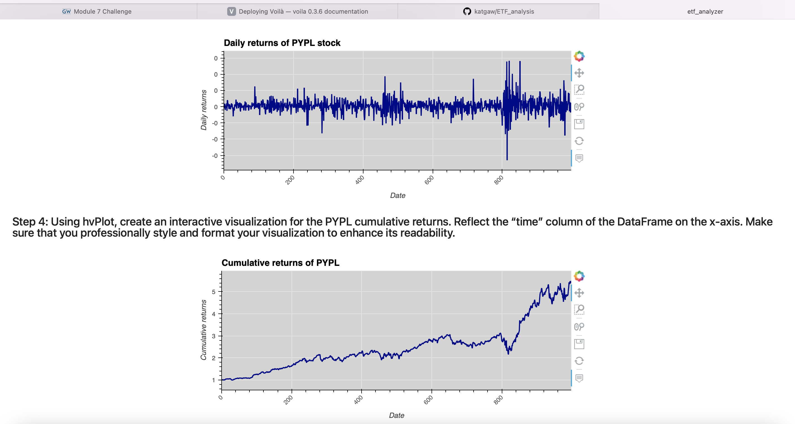
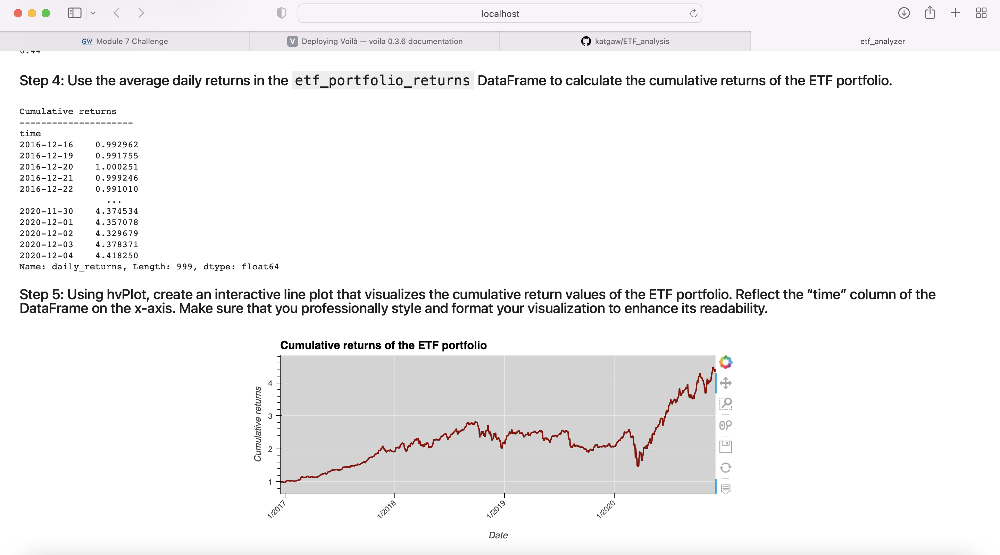

# *Analysis of ETF portfolios*
---

**Welcome to my repository for the project on the ETF portfolios. Please explore the codebase!** <br />

>“It is better to be roughly right than precisely wrong.” – John Maynard Keynes
---
## Analytical Summary

This project analyzes and visualizes ETF portfolios, the product is deployed as a web application. The ETF data is analyzed from a SQL database. The database consists of four stocks: GOST, GS, PYPL, and SQ.

---

## Technologies

This project leverages python 3.7 with the following packages:
* [numpy](https://numpy.org) - Library for fast manipulation of n-dimensional arrays.

* [pandas](https://pandas.pydata.org) - Library for fast manipulation with DataFrames, reading and writing csv files.

* [hvplot.pandas](https://hvplot.holoviz.org) - Library for interactive graphs.

* [sqlalchemy](https://sqlalchemy.org) - Library as the Python SQL toolkit.

* [voila](https://voila.readthedocs.io/en/stable/) - Library for creating web applications.
---

## Installation Guide

Before running the application first install the following dependencies.

```python
  pip install numpy
  pip install pandas
  conda install -c pyviz hvplot
  pip install SQLAlchemy
  pip install voila
```
---

## Usage

To use this project simply clone the repository and run the code **etf_analyzer.ipynb** in JupyterLab or in VS Code.

---
## Graphs

The web application visualizes the analysis of the ETF portfolios.
First graphs plot daily and cumulative returns of PYPL stock.



Second graph provides the overall cumulative returns of the entire ETF portfolio.



---

## Contributors

Brought to you by Katerina Gawthorpe.

---

## License

MIT